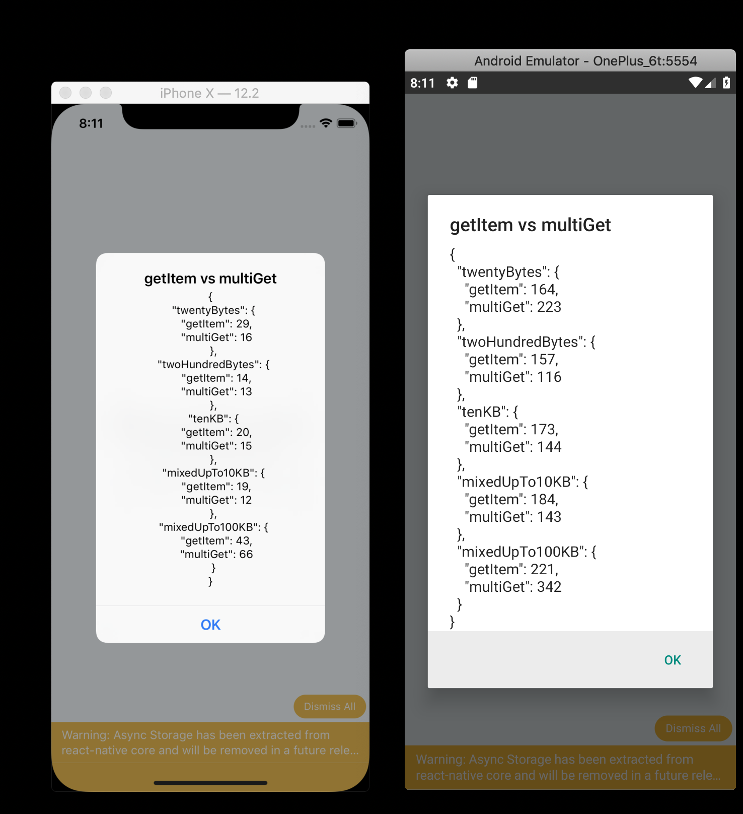
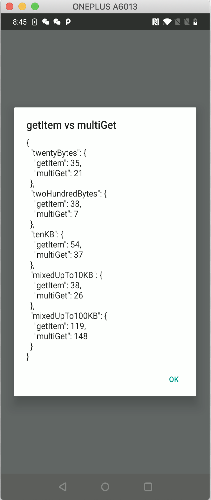

## Usage

run this app on your phone to compare the performance of `AsyncStorage`'s `multiGet([key])` vs `getItem(key)`

the numbers are in millis (lower is better)

Perf on simulator/emulator:

Perf on iPhone 6+ release mode (in debug mode there's virtually no advantage to using `multiGet`)

Perf on OnePlus 6t release mode:

